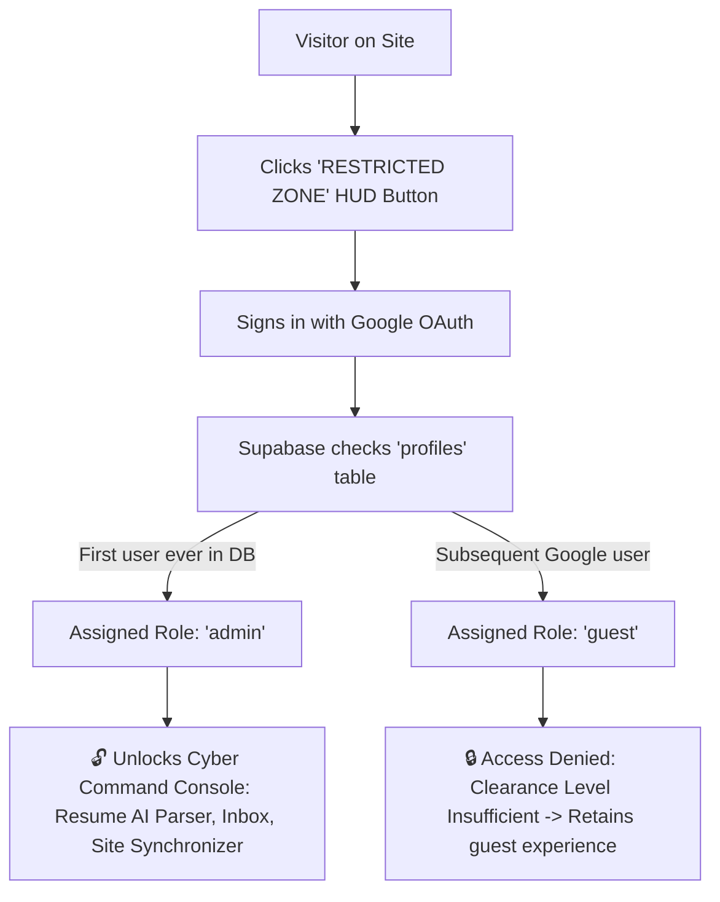

# ⚡ Cyber-Resume & Technical Portfolio 2050

An interactive, high-performance cyberpunk portfolio and neural command console built with Vanilla HTML5/CSS3/JS, Supabase (PostgreSQL & RBAC), Google OAuth 2.0, PDF.js, and an arcade Cybertruck dodge engine.

Designed for developers, engineers, and consultants who want a futuristic web portfolio with a **Restricted Zone Admin Command Hub** that enables 1-click resume replacements and automated AI profile synchronization without manually editing code.

---

## 🌟 Key Features

- 🎮 **Cybertruck Arcade Engine**: Custom HTML5 Canvas 2D dodge game with retina HiDPI scaling, Web Audio retro synthesizer, and return-visitor unlock engine.
- 🛡️ **Restricted Zone & Role-Based Access (RBAC)**:
  - **First-Time Admin Claim**: The very first Google account to log into the application is automatically granted the `admin` clearance role in PostgreSQL.
  - **Guest Protection**: Any subsequent visitor logging in with a different Google account receives a `guest` role with access limited to viewing, playing the game, downloading the resume, and sending inquiries.
  - **PostgreSQL Row Level Security (RLS)**: Protects all mutation operations directly at the database layer.
- 📄 **In-Browser Resume Parser & Dynamic Sync**:
  - Drag-and-drop any PDF resume in the Admin Portal.
  - In-browser text layer & hyperlink annotation extraction (via PDF.js) and optional Google AI Studio (Gemini Flash) parsing.
  - Automatically updates **Summary**, **Work History**, **Education & Coursework**, **6 Dynamic Skill Categories**, and **Social Links** without touching source code.
- 📡 **"Contact Me" Transmission Engine**:
  - Cyberpunk modal with telemetry transmission feedback.
  - Dispatches inquiries directly to your Outlook/Gmail inbox via EmailJS.
  - Automatically logs every inquiry into the Supabase database for review in the Admin Inbox.
- 🚀 **100% Static & Serverless**: Runs completely in the browser with CDN dependencies—deployable to **GitHub Pages**, **Vercel**, or **Netlify** with a simple `git push`.

---

## 🛠️ Technology Stack

| Component | Technology |
| :--- | :--- |
| **Frontend Core** | Semantic HTML5, Vanilla Modern CSS, ES6+ JavaScript |
| **Animations & Effects** | GSAP 3.12, ScrollTrigger, CRT Scanlines, Web Audio API |
| **Database & Auth** | Supabase (Managed PostgreSQL, Google OAuth 2.0, JSONB, RLS) |
| **Document Processing** | PDF.js 3.11 (Text Layers & Link Annotations), Google Gemini Flash API |
| **Email Dispatch** | EmailJS SDK / Webhook |
| **Hosting** | GitHub Pages (Static hosting) |

---

## 🚀 Quick Start (Local Development)

Because this application is built with standard client-side ES6 modules and CDN libraries, **no build step is required**.

### 1. Clone the Repository
```bash
git clone https://github.com/officialakash96/portfolio2050.git
cd portfolio2050
```

### 2. Start a Local Static Server
You can use Python, Node, or VS Code Live Server:

**Using Python:**
```bash
python3 -m http.server 8088
```

**Using npx:**
```bash
npx live-server
# or
npx serve .
```

### 3. Open in Browser
Visit **`http://localhost:8088`** (or the port shown in your terminal).

---

## ⚙️ Complete Setup & Configuration Guide

To enable Google Sign-In, the Admin Command Console, and the Contact form on your own instance, follow these steps:

### Step 1: Set Up Supabase Database (Free Tier)

1. Create a free account at [https://supabase.com](https://supabase.com) and create a **New Project**.
2. Once created, click the **SQL Editor** (`>_`) in the left sidebar.
3. Open [`supabase-schema.sql`](./supabase-schema.sql), copy the entire SQL script, paste it into the editor, and click **Run**.
   *This automatically sets up the `profiles` table, auto-admin claiming trigger, `site_content` table, `contact_messages` table, and Row Level Security (RLS) policies.*
4. Go to **Project Settings** (gear icon) > **API** and copy:
   - **Project URL** (`https://<project-ref>.supabase.co`)
   - **anon public API Key** (`eyJhbGciOi...`)

---

### Step 2: Set Up Google OAuth in Google Cloud Console

1. Open [Google Cloud Console Credentials](https://console.cloud.google.com/apis/credentials).
2. Create or select a project.
3. Configure the **OAuth Consent Screen**:
   - User Type: **External** > Click **Create**.
   - App Name: `My Cyber Portfolio`
   - User Support Email: your email.
   - Developer Contact Email: your email.
   - Save and continue through scopes (defaults `email`, `profile`, `openid` are sufficient).
   - *(Optional: Click "Publish App" so any Google user can authenticate).*
4. Create **OAuth 2.0 Credentials**:
   - Go to **Credentials** > **+ CREATE CREDENTIALS** > **OAuth client ID**.
   - Application Type: **Web application**.
   - Under **Authorized JavaScript origins**, add:
     - Your Supabase Project URL: `https://<project-ref>.supabase.co`
     - Your local dev URL: `http://localhost:8088` (and `http://127.0.0.1:54445` if using live-server)
     - Your production domain: `https://<username>.github.io`
   - Under **Authorized redirect URIs**, add your Supabase Auth callback:
     - `https://<project-ref>.supabase.co/auth/v1/callback`
   - Click **Create** and copy your **Client ID** and **Client Secret**.

---

### Step 3: Enable Google Auth in Supabase

1. In your **Supabase Dashboard**, go to **Authentication** > **Providers** > **Google**.
2. Toggle Google to **Enabled**.
3. Paste your **Client ID** and **Client Secret** and click **Save**.
4. Go to **Authentication** > **URL Configuration**:
   - **Site URL**: `https://<username>.github.io/<repo-name>/` (or your custom domain)
   - Add your local and production URLs to **Redirect URLs**:
     - `http://localhost:8088/`
     - `https://<username>.github.io/<repo-name>/`

---

### Step 4: Configure Credentials in Code

Open [`supabase-config.js`](./supabase-config.js) and update your Supabase URL and anon key:
```javascript
this.supabaseUrl = localStorage.getItem(this.STORAGE_URL_KEY) || 'https://<YOUR-PROJECT-REF>.supabase.co';
this.supabaseAnonKey = localStorage.getItem(this.STORAGE_KEY_KEY) || 'YOUR_ANON_PUBLIC_KEY';
this.recipientEmail = localStorage.getItem(this.STORAGE_RECIPIENT_EMAIL) || 'your.email@example.com';
```

*(Note: The `anon` key is designed by Supabase to be public and is protected by PostgreSQL RLS. You can also configure these values directly in the browser via the Admin Portal's Cloud Settings tab).*

---

### Step 5: (Optional) Set Up EmailJS for Contact Me Form

1. Sign up at [https://www.emailjs.com](https://www.emailjs.com) (Free tier includes 200 emails/month).
2. Add an **Email Service** connected to your personal Gmail/Outlook mailbox.
3. Create an **Email Template** with parameters `{{from_name}}`, `{{from_email}}`, `{{message}}`, and `{{to_email}}`.
4. In [`contact-module.js`](./contact-module.js), set your EmailJS Service ID, Template ID, and Public Key:
   ```javascript
   this.serviceId = 'service_cyber_contact';
   this.templateId = 'template_contact';
   this.publicKey = 'YOUR_EMAILJS_PUBLIC_KEY';
   ```

---

### Step 6: (Optional) Google AI Studio API Key for Deep AI Parsing

1. Visit [Google AI Studio](https://aistudio.google.com) and click **Get API key**.
2. In the Admin Portal (**RESTRICTED ZONE** > **Cloud Settings** tab), paste the Gemini API key and click **Save Credentials**.
3. The parser will utilize Gemini 1.5/2.0 Flash for structured semantic extraction with heuristic fallback when offline.

---

## 🔐 Admin vs. Guest Login Workflow



1. **Claiming Admin**: The first person to click **`RESTRICTED ZONE`** and sign in with Google becomes the permanent owner/admin.
2. **Accessing the Console**: Click the pulsing green **`[ADMIN ACCESS]`** badge to open the Cyber Command Console.
3. **Uploading a Resume**:
   - Go to **RESUME & AI SYNC** tab.
   - Drag and drop your `.pdf` resume file.
   - Click **`ANALYZE & EXTRACT DATA`**.
   - Review and fine-tune the parsed fields in the interactive editor.
   - Click **`DEPLOY TO LIVE SITE`** to synchronize your portfolio instantly.
4. **Managing Inquiries**:
   - Go to **INBOX & INQUIRIES** tab to view received transmissions, reply via 1-click email, and change your target forwarding mailbox.

---

## 📁 Repository Structure

```
├── index.html            # Main markup, HUD status bar, modals, and dynamic containers
├── style.css             # Cyberpunk design system, glassmorphism, animations, responsive layout
├── script.js             # Site orchestration, visit tracking, GSAP reveals, dynamic DOM hydration
├── game.js               # Cybertruck arcade engine, Web Audio synth, touch & keyboard controls
├── supabase-config.js    # Supabase client service, Google OAuth, RBAC inspection, site content sync
├── supabase-schema.sql   # PostgreSQL schema, auto-first-admin trigger, RLS policies, table setup
├── resume-parser.js      # PDF.js text layer & link annotation extractor + Gemini Flash AI parser
├── contact-module.js     # Contact transmission modal, client validation, EmailJS & DB logging
├── admin-portal.js       # Admin command console UI, tabs, resume review editor, inbox manager
└── static/               # Assets, profile picture, and default downloadable PDF resume
```

---

## 🚢 Deploying to GitHub Pages

1. Commit and push your changes to the `main` branch:
   ```bash
   git add .
   git commit -m "feat: setup portfolio"
   git push origin main
   ```
2. In your GitHub repository:
   - Go to **Settings** > **Pages**.
   - Set **Source** to `Deploy from a branch`.
   - Select `main` branch and `/ (root)` folder > Click **Save**.
3. Your portfolio will be live at `https://<your-username>.github.io/<repo-name>/`.

---

## 📄 License

This project is licensed under the [MIT License](LICENSE). Feel free to customize, extend, and use it for your own personal portfolio!
